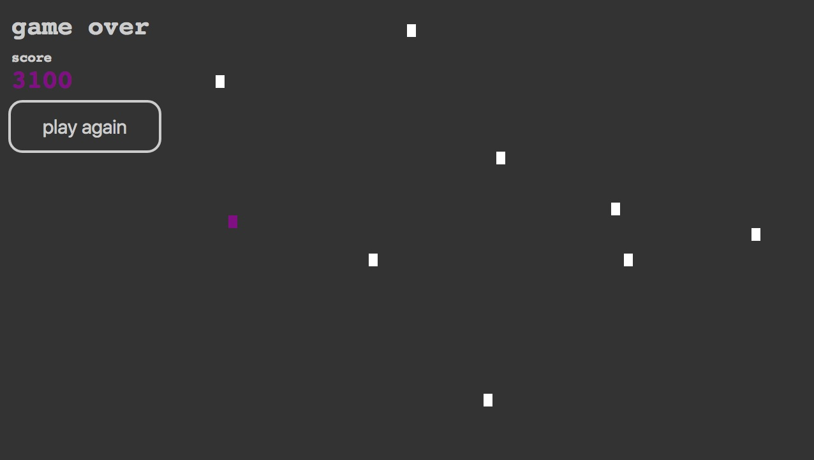

The faster you move the more points you get!



##Instructions

Move the purple curssor onto the white boxes.

Each time there is a collision new boxes will apear.

Higher points and bonus seconds are rewared for faster collisions so using vim combinations is key.

###Vim primer

Move cursor
```
j down
k up
l left
h right
```

Combinations
```
11j moves down 11 times
28k moves up 28 times
```

If you just want to practice number combos you can also use the arrow keys
```
11-> moves right 11 times
12<- moves left 12 times
```

###Needs to be done
Explore functional programming concepts while rewriting this code
Separate code into modules
